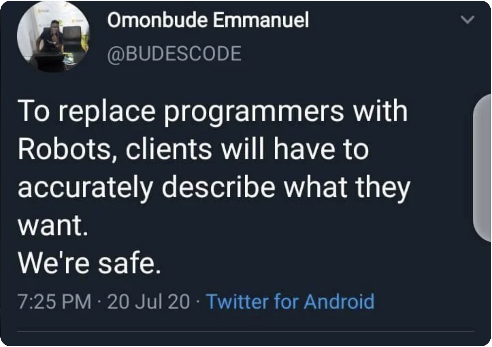

#SoftA [[../Notizen/01ln-intro.md]]

---
# Softwarearchitektur

---

# Introduction

- Software Architecture: mandatory class for CS majors
- materials
	- https:/Notizen
	- Github organization: https:/github.com/ohm-softa
	- ...in English! &#x263A;
	- slides, lecture notes, assignments (with READMEs)
- tutorials: 
	- Tuesdays at *9.45a* in SP.467 (Riedhammer & Tallowitz)
	- Tuesdays at *2p* in SP.467/468 (Braun & Tallowitz)
	- _nota bene: assignments typically take longer than 90'!_

???

https:/github.com/gnab/remark/wiki/Formatting

Materialien auf Englisch, Vorlesung aber auf Deutsch.
Github orga ist closed/BIO--by invitation only
Übungen können die meisten nicht in 90' Programmieren.

---

# Credits (Leistungsnachweis)

- written exam (90') at the end of the term
- you may bring three (3) pages notes (stapled and signed)
- you must sign up for the exam
- theoretical and coding questions

---

# Review (what you should know by now!)

## Prozedurale Programmierung
- imperative programming
- constants, variables, expressions, functions, I/O
- basic data structures (fields, arrays, lists)
- pointers &#x263A;

## Objektorientierte Programmierung
- OOP, classes and objects (and references! &#x263A;)
- basic data structures (lists, maps, etc.)
- interfaces and inheritance
- errors, exceptions and how to deal with them

---

# Agenda for Software Architecture

See https:/Notizen/ (Syllabus)

- modularity and component based development
- UML, mostly class, component and sequence diagrams
- programming patterns: idioms, design, architecture
- assignments: tools and toolkits

Assignments follow the lecture.

---

# About this Class

### I'd like you to become better programmers

### Some slides, but mostly hands-on live coding (plus lecture notes!)

.skip[
All examples are found in the `/examples/` directory of the [site's repository](https:/github.com/ohm-softa/Notizen/tree/master/examples).
]

---

# A note on (programming) languages

- class materials are in English (so is most of the internet/SO)
- examples are (mostly) in Java...
- ...but translate to C#, C++, Python, Scala, etc.
- we'll focus on the concept, not the language

.skip[
.center[

]
]

---

# Software Architecture

...is a craft.

- takes practice
- takes patience
- takes diligence
- takes experience

---

# A word on GPT

.center[

]

- Yes, GPT will produce correct code for most of the common programming problems
- Yes, you should use GPT.
- The point is: you need to understand what the use case requires, and then find the right coding concept.

---

# Don't be that guy...

.center[

]

.right[
<https:/xkcd.com/292/>
]

---

# Speaking of `goto`

## Why would you use `goto`?

## Is it possible in C#?

## Is it possible in Java?

???

c#: yes, emulate while, break outer loops

Java: no; but break out of outer loops with labelled loops and labeled break/continue

---

.center[

]

.right[
<https:/xkcd.com/844/>
]

---

# Agenda today

1. What is software architecture?
2. What is abstraction?
3. What is decomposition?
4. Clean Code
5. Tools

---

# Software Architecture

Thoughts?

---

# Software Architecture

## Complexity

- Ideal: linear process (analysis, draft, implementation, test, maintenance)
- Constrained by: features, budget, time
- Real world: somethings changes along the way...

## Architecture

- Result of the software development process
- Components, systems, subsystems, etc.
- V-model, agile, ..., typically recurrent at some stage

---

# Abstraction

Thoughts?

---

# Abstraction

## high level → low level

- drive to the airport
- → go straight, right, straight, left, ...
- →→ clutch, brake, ignition, put in drive, ...

.skip[
- reduce complexity by removing details
- goal: model a system from a specific point of view
]

???

see: H. Stachowiak: Allgemeine Modelltheorie, Springer Verlag, 1973

--- 

# Abstraction

## Example: programming

- hardware instructions
- assembler (low-level)
- c, fortran, java (high-level)
- code generators

---

# Decomposition

Thoughts?

---

# Stepwise Refinement

> [...] a sequence of design decisions concerning the decomposition of a task into subtasks and of data into data structures

N. Wirth, "[Program Development by Stepwise Refinement](https:/dl.acm.org/citation.cfm?id=362577)", Comm. ACM, 1971

→ break problem down in simpler problems until solvable

---

# Functional Decomposition

- Thoughts follow the process
- Bottom-up/top-down

### Example: Withdraw cash at ATM

- insert debit card
- enter pin
- select amount
- process cash
- ...

---

# Object Oriented Decomposition

> it is almost always incorrect to begin the decomposition of a system into modules on the basis of a flowchart. We propose instead that one begins with a list of difficult design decisions or design decisions which are likely to change. Each module is then designed to hide such a decision from the others. Since, in most cases, design decisions transcend time of execution, modules will not correspond to steps in the processing.

D.L. Parnas, "[On the Criteria used in Decomposing Systems into Modules](https:/dl.acm.org/citation.cfm?id=361623)", Comm. ACM, 1972

### Modularization and Encapsulation

> Every module [...] is characterized by its knowledge of a design decision which it hides from all others. Its interface or definition was chosen to reveal as little as possible about its inner workings.

→ Coherence and loose/tight coupling

???

probably one of the reasons OOP became so popular...

---

# Some Guidelines for Good (OO) Architecture

## High Cohesion, Low Coupling

There should be high cohesion within classes and packages, but low coupling between objects and across packages.

## Law of Demeter

In simple words: "Each unit should have only limited knowledge about other units: only units "closely" related to the current unit.".

K. Liebherr, I. Holland and A. Riel: "[Object-oriented programming: an objective sense of style](https:/dl.acm.org/citation.cfm?id=62113)", Proc. OOPSLA, 1988

## High Fan-In, Low Fan-Out

---

# A Bit of "Historic" Context

- early days of programming (pre 60s!) focused on procedures
- the 1970s layed the ground work (see previously cited papers!)
- 1970: Smalltalk (Xerox PARC; object oriented language)
- 1973: ML (U Edinburgh; functional language)
- 90s and 2000s: OOP widely taught as "gold standard", FP often considered "academic"
- 2010s and onwards: heavy parallelization reintroduced FP (almost hype!)
	- "old" languages introduce functional elements (Java, C++, ...)
	- Scala
	- Actor frameworks, e.g. Akka

---

# Clean Code

<http:/www.netlib.org/clapack/cblas/dgemm.c>

---

# Clean Code

- Choose good naming conventions
- Methods should be short, concise and with few paramters
- Comments only where needed; rewrite bad code
- Java conventions?
	- [Google Java Format](https:/github.com/google/google-java-format)
	- [Elasticsearch](https:/github.com/elastic/elasticsearch/blob/master/CONTRIBUTING.md#contributing-to-the-elasticsearch-codebase)
- Please read "Clean Code" by Prof. Tavakoli (`Teams > General > Files`)

---

# Tools

- Your preferred search engine
- Your preferred interactive generative information system*)
- [Stack Overflow](https:/stackoverflow.com/questions/tagged/java)
- [Java documentation](https:/docs.oracle.com/javase/11/docs/)
- JetBrains [IntelliJ](https:/www.jetbrains.com/idea/), Community Edition (free!*)
- [Git version control](https:/git-scm.com/)

.skip[
Of course, you can use Claude Code, ChatGPT, GitHub Copilot, etc. (which will produce perfect solutions to the assignments), but the point of this class is to grok the problems on your own!
]

*) Mind you: assignments are not mandatory &mdash; copying a solution typically has zero benefit
