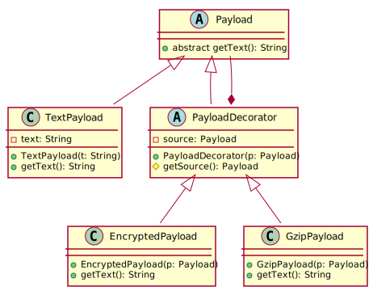

#SoftA [[../Notizen/03ln-inheritance.md]]

---

# Inheritance Revisited

- extending classes vs. implementing interfaces
- Liskov's substitution principle (LSP)
- abstract classes
- final classes and methods
- inheritance and shadowing
- multiple inheritance
- the diamond problem
- decorator pattern

---

# Liskov Substitution Principle

> Subtype Requirement: Let ϕ(x) be a property provable about objects x of type T. Then ϕ(y) should be true for objects y of type S where S is a subtype of T.

_Barbara Liskov and Jeanette M. Wing: A Behavioral Notion of Subtyping, ACM Transactions on Programming Languages and Systems, Vol 16, No. 6, November 1994, Pages 1811-1841._

---

# Abstract Classes: Original

```java
interface DBItem {
    String makeInsertSQL();
}
```
```java
class Student implements DBItem {
    private String name;
    private int matrikel;
    public String makeInsertSQL() {
        return "INSERT INTO student (name, matrikel) VALUES (" 
            + name + ", " + matrikel + ")";
    }
}
```
```java
class FWPM implements DBItem {
    String name, description;
    int numPart;
    public String makeInsertSQL() {
        return "INSERT INTO fwpm (name, numPart, description) VALUES (" 
            + name + ", " + numPart + ", " + description + ")";
    }
}
```

---

# Abstract Classes: Improved

```java
abstract class DBItem {  // note: could also use interface and default methods
    String makeInsertSQL() {
        return "INSERT INTO " + getTable() + " (" + getFields()) 
            + ") VALUES (" + getValues() + ")";
    }

    abstract String getTable();
    abstract String getFields();
    abstract String getValues();
}
```
```java
class Student extends DBItem {
    private String name;
    private int matrikel;
    String getTable() { 
        return "student"; 
    }
    String getFields() {
        return "name, matrikel";
    }
    String getValues() {
        return name + ", " + matrikel;
    }
}
```

---

# "Multiple Inheritance" with modular code

```java
interface Van {
    List getPersons();
    default void board(Person p) {
        getPersons().add(p);
    }
    // ...
}
```
```java
class VwTransporterPickup implements Van, ... {
    private List persons;
    public List getPersons() {
        return persons;
    }
    // ...
}
```

Pull functionality into interfaces with default methods, using enforced getters/setters for data elements.

---

# Decorator Pattern

<div>
    <div style="float: right; width: 60%; height: 100%">
        
    </div>
    <div>
        <ul>
        <li>Add functionality to instances of existing class</li>
        <li>Decorator maintains reference to instance of main class</li>
        <li>Allows for arbitrary chaining</li>
        <li>See for example Java IO classes</li>
        </ul>
    </div>
</div>


