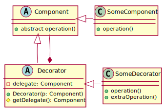
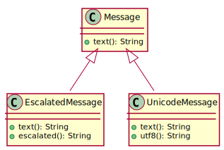
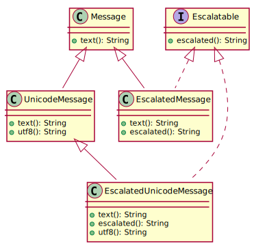

#SoftA [[../Notizen/04ln-generics-1.md]]

---

<h1>Mixins, part one.</h1>

### Aspected Oriented Programming

---

# Review: Decorator Pattern

---

# Decorator Pattern

Extend ("decorate") functionality of classes while maintaining primary signature.

<div>
    <div style="float: left; width: 45%; height: 100%">
        
    </div>
    <div style="width: 55%; float: left">
        <ul>
            <li>Shared base class or interface</li>
            <li><span class="remark-code remark-code-line">Delegate</span> calls</li>
            <li>Add/overload methods as needed</li>
            <li>Great for cascaded processing</li>
        </ul>
    </div>
</div>

<div style="clear: both"></div>

```java
FileInputStream fis = new FileInputStream("/objects.gz");
BufferedInputStream bis = new BufferedInputStream(fis);
GzipInputStream gis = new GzipInputStream(bis);
ObjectInputStream ois = new ObjectInputStream(gis);
SomeObject someObject = (SomeObject) ois.readObject();
```

---

# Review: Inheritance and Interfaces

---

# Inheritance and Interfaces

Example:

- Send text messages (`Message`)
- `EscalatedMessage` by using all-caps (_scream_).
- `UnicodeMessage` for fancy smileys 😎

.center[

]

#### How about _escalatable_ _unicode_ messages?


---

# Review: Inheritance and Interfaces

To maintain the type hierary, add an interface `Escalatable` to allow for `is-a Escalatable`.

.center[

]

#### Drawback: Code duplication!

---

# Mixins

In OOP, _mixins_ are constructs that

- can be included with other classes without being a base class
- only make sense in combination with the target class


#### Objective

- **Single** implementation for all classes
- `has-a`/`can-do` instead of `is-a`

#### Related Topics

- _Aspect Oriented Programming (AOP)_
- _Dependency Inversion_

---

<h1>Mixins in Java</h1>

Use `default` methods!

```java
public `interface` Escalated {
    String getText();
    `default` String escalated() {
        return getText.ToUpper();
    }
}
public class Message `implements Escalated` {
    private String m;
    public Message(String m) { this.m = m; }

    public String getText() {
        return m;
    }
}
```


```java
Message m = new Message("Hello World");
System.out.println(`m.escalated()`);       // "HELLO, WORLD"
```

---

# Generics, part one.

- Generic classes and interfaces
- Type erasure, raw type and instantiation
- Generic methods

---

# Generic Classs/Interfaces

Prior to Java 1.5: via `Object` and explicit type casts

```java
interface List {
    void add(Object o);  // appends to the list
    Object get(int i);   // retrieves the i-th element
}
```
```java
interface Map {
    void put(Object key, Object value);  // stores object for key
    Object get(Object key);              // retrieves object for key
}
```
```java
Map map = new SimpleMapImpl();
map.put("Hans", 123);
map.put("Peter", "Pan");

Integer i1 = (Integer) map.get("Hans");   // forced type cast
Integer i2 = (Integer) map.get("Peter");  // ClassCastException!
```

---

# Generic Classes/Interfaces

Bad solution.

```java
class SimpleStringIntMapImpl extends SimpleMapImpl {
    public Integer get(String key) {
        Object val = super.get(key);
        if (val == null)
            return null;
        else
            return (Integer) val;
    }
}
```

---

# Generic Classes/Interfaces

Make generic, using `<>` and type parameters (variables).

```java
interface Map<K, V> {
    void put(K key, V value);
    V get(K key);
}
```

---

# Generic Classes/Interfaces

Tying types to type parameters.

```java
// (1) define actual types: all type parameters bound
class SimpleStringIntMapImpl implements Map<String, Integer> {
    public void put(String key, Integer value) {
}
```
```java
// (2) carry over type list: still two type parameters
class SimpleMapImpl<K, V> implements Map<K, V> {
    public void put(K key, V value) {
```
```java
// (3) partially carry over; here: one type parameter remains
class SimpleStringMapImpl<V> implements Map<String, V> {
    public void put(String key, V value) {
}
```

---

# Generic Classes/Interfaces


```java
public class SimpleMapImpl<K, V> implements Map<K, V> {
    class Entry {
        public Entry(K key, V value) {
            this.key = key;
            this.value = value;
        }
        K key;
        V value;
        Entry next;
    }

    Entry head;

    @Override
    public void put(K key, V value) {
        // ...
    }

    @Override
    public V get(K key) {
        // ...
    }
}
```

---

# Type Erasure

- Remember: type parameters will be deleted after compilation
- If you must instantiate during runtime: use `Class<T>` and reflection

---

# Generic Methods

Prior to Java 1.5: via `Object` and explicit type casts.

```java
static Object[] reverse(Object[] arr) {
    Object[] clone = arr.clone();
    for (int i = 0; i < arr.length/2; i++) {
        swap(clone, i, arr.length - 1 - i);
    }
    return clone;
}
private static void swap(Object[] arr, int i, int j) {
    Object h = arr[i];
    arr[i] = arr[j];
    arr[j] = h;
}
```
```java
public static void main(String... args) {
    Integer[] arr = {1, 2, 3, 4, 5};
    Integer[] rev = (Integer[]) reverse(arr);  // explicit type cast

    / will produce `ClassCastExecption` at runtime!
    Integer[] oha = (Integer[]) reverse(new String[] {"Hans", "Dampf"});
}
```

---

# Generic Methods

Java 1.5 and on: use type parameters.

```java
static <T> T[] reverse(T[] in) {
    T[] clone = in.clone();
    for (int i = 0; i < in.length/2; i++) {
        swap(clone, i, in.length - 1 - i);
    }
    return clone;
}
private static <T> void swap(T[] arr, int i, int j) {
    T h = arr[i];
    arr[i] = arr[j];
    arr[j] = h;
}
```
```java
public static void main(String... args) {
    Integer[] arr = {1, 2, 3, 4, 5};
    Integer[] rev = reverse(arr);  // type safety at compile time!

    // will produce error at compile time! (Integer[] and String[] incompatible)
    Integer[] oha = reverse(new String[] {"Hans", "Dampf"});
}
```

