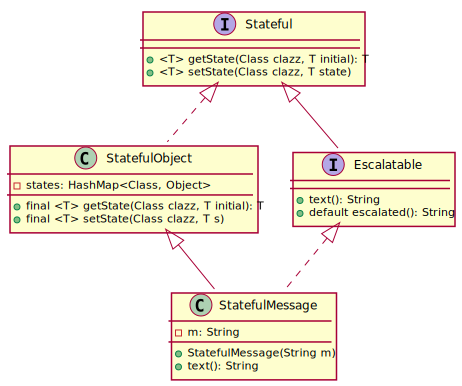
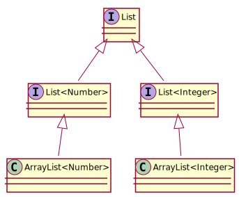
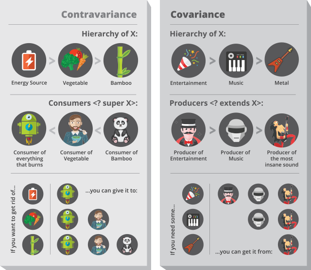

#SoftA [[../Notizen/05ln-generics-2]]

---

<h1>Mixins, part two.</h1>

### Aspected Oriented Programming

---

<h1>Mixins in Java</h1>

Use `default` methods!

```java
public `interface` Escalated {
	String getText();
	`default` String escalated() {
  		return getText.ToUpper();
	}
}
public class Message `implements Escalated` {
	private String m;
	public Message(String m) { this.m = m; }

	public String getText() {
		return m;
	}
}
```


```java
Message m = new Message("Hello World");
System.out.println(`m.escalated()`);       // "HELLO, WORLD"
```

---

# Stateful Mixins

Current implementation is simple -- but stateless!

What about incresing escalation??

```
Hello, World
HELLO, WORLD
HELLO, WORLD!
HELLO, WORLD!!
HELLO, WORLD!!!
```

---

# Stateful Mixins (Variant A)

Use `WeakHashMap` to memorize state for each instance.

```java
public interface StatefulEscalate {
	String getText();

	// static member!
	WeakHashMap<StatefulEscalate1, Integer> state 
		= new WeakHashMap<>();

	default String escalated() {
		int n = state.getOrDefault(this, 0);

		state.put(this, n+1);

		return getText().toUpperCase() +
				Stream.generate(() -> "!").limit(n).reduce("", (a, b) -> a + b);
	}
}
```

- drawback: state is `public`, thus exposed! 😒

---

# Stateful Mixins (Variant B)

What about

- a secure way to manage state?
- multiple mixins and different state?

---

# Stateful Mixins (Variant B)

Same principle, but maintain state with actual instance...

...for each mixin (interface) separately!

```java
public interface Stateful {
	<T> T getState(Class clazz, T initial);
	<T> void setState(Class clazz, T state);
}

public class StatefulObject implements Stateful {
	// object -> interface -> state object
	private HashMap<Class, Object> state 
		= new HashMap<>();
	@Override
	public `final` <T> T getState(Class clazz, T initial) {
		// cast necessary, since internally we store Object
		return (T) state.getOrDefault(clazz, initial);
	}
	@Override
	public `final` <T> void setState(Class clazz, T o) {
		state.put(clazz, o);
	}
}
```

---

# Stateful Mixins (Variant B, cont'd)

```java
public interface StatefulEscalate2 extends Stateful {
	String getText();

	default String escalated() {
		/ no typecast... generic methods ftw!
		int n = getState(StatefulEscalate2.class, 0);
		setState(StatefulEscalate2.class, n+1);

		String bangs = Stream.generate(() -> "!")
			.limit(n).reduce("", (a, b) -> a + b);

		return getText().toUpperCase() + bangs;	
	}
}
```
```java
public interface StatefulConfusable extends Stateful {
	String text();

	default String confuse() {
		String s = getState(StatefulConfusable.class, "?");
		setState(StatefulConfusable.class, s + s);

		return text() + s;
	}
}
```

---

<h1>Attach Mixins to Target Class</h1>

```java
public class StatefulMessage extends StatefulOject 
		implements StatefulConfusable, StatefulEscalate2 {
	private String m;
	public StatefulMessage(String m) { this.m = m; }

	@Override
	public String getText() {
		return m;
	}
}
```
```java
public class App {
	public static void main(String[] args) {
		StatefulMessage m1 = new StatefulMessage("Hans");
		StatefulMessage m2 = new StatefulMessage("Dampf");

		System.out.println(m1.escalated());  // "HANS"
		System.out.println(m2.escalated());  // "DAMPF"
		System.out.println(m2.escalated());  // "DAMPF!"

		System.out.println(m1.confuse());    // "HANS?"
		System.out.println(m1.confuse());    // "HANS??"
		System.out.println(m2.confuse());    // "DAMPF?"
	}
}
```

---

# Final Class Hierarchy



---

# Generics, part two.

- Generics and inheritance
- Bounds on type variables
- Wildcards
- Bounds on wildcards

---

# Generics and Inheritance



---

# Covariance and Contravariance



---

# Summary

- Use bounds on type variables where necessary
- Use wildcards with upper (read) and lower (write) boundaries to work with container classes
- Avoid wildcards on return types.
