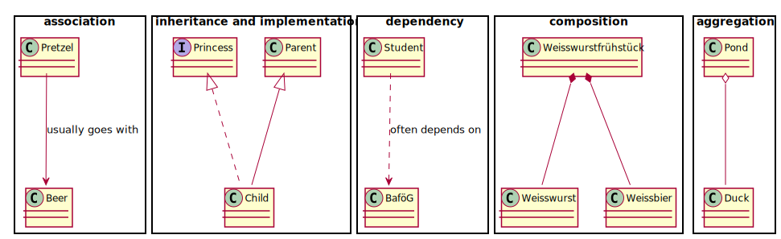

#SoftA [[../Notizen/07ln-iterator-composite-observer.md]]

---

# Design Pattern, pt. 1

## Iterator, Composite and Observer

Korbinian Riedhammer

---

# Recommended Reading


## [Design Patterns](https:/www.amazon.de/Patterns-Elements-Reusable-Object-Oriented-Software/dp/0201633612/)
by Gamma/Helm/Johnson/Vlissides (_Gang of Four_).

---

.skip[]

> All well-structured object-oriented architectures are full of patterns.
> Indeed, one of the ways I measure the .h[quality of an object-oriented system] is to judge whether or not its developers have paid careful attention to the .h[common collaborations among its objects].
> Focusing on such mechanisms during a system's development can yield an .h[architecture that is smaller, simpler and far more understandable] than if these patterns are ignored.

.skip.right[
Grady Booch, Foreword to Design Patterns, 1994(!)
]

---

# Design Patterns

Patterns that emerged for solving frequent problems

Shared vocabulary for developers
- common ground for talking about architecture
- less talking, more doing

Patterns are based on principles of object-oriented programming.
- interfaces, inheritance
- composition, delegation and encapsulation

Toolset for a clear software architecture.

---

# Class Diagrams

.skip[

]

**Composition**: real-world whole-part relation

**Aggregation**: "catalog" containment, can exist independently

---

# Sequence Diagrams

.skip.center[

]

---

# Iterator

```java
SimpleList<Integer> list = SimpleList<>(3, 1, 3, 3, 7);
```

.container[
.column[

```java
int i = 0;
for ( ; i < list.size(); ) {
	System.out.println(list.get(i));
	i++;
}
```
]

.column[

```java
int i = 0;
while (i < list.size()) {
	System.out.println(list.get(i));
	i++;
}
```
]
]

.container[

```java
Iterator<Integer> it = list.???;

while (it.hasNext()) {
	Integer v = it.next();
}
```
]

How does an iterator look like?

---

# Iterator


```java
class SimpleList<T> implements BasicList<T> {
	/ ...
	public Iterator<T> iterator() {
		return new Iterator<T>() {
			Element it = root;
			@Override
			public boolean hasNext() {
				return it == null;
			}

			@Override
			public T next() {
				T value = it.value;
				it = it.next;
				return value;
			}
		};
	}
}
```

---

# Composite

.skip.center[

]

---

# Composite

.skip.center[

]

---

# Composite Examples

- file systems: identifier, directory, file, link
- JUnit:
	+ component: _test_
	+ composite: _test suite_ comprised of multiple tests
	+ leaf: individual test case
- HTML documents:
	+ component: _element_
	+ composite: containers (`div`, `p`, etc.)
	+ leaf: _text nodes_
- GUI libraries (such as Android)
	+ component: `android.view.View`
	+ composite: `android.view.ViewGroup`
	+ leaf: individual widgets, e.g. `Button`

---

# Observer

.skip.center[

]

---

# Observer

.skip.center[

]

---

# Model-View-Controller

.container[
.column[

]

.column.w60[
**Model**: 
- current data and state of the app
- Java program

**View**: 
- visualization of data and state
- JavaFX widget library

**Controller**: 
- business logic (by you)
- user input (provided by OS)
]
]

.container[
_Sometimes you will see Model-View-Viewcontroller (MVVC) or Model-View-Viewmodel (MVVM), adding an intermediate layer._
]

---

# Model

Data structures, entity types, auxiliary types.

Core algorithms to load, store, organize and transform data.*

Typically implemented in (pure) Java.**

Examples:
- `Joke` class to store jokes from CNJDB
- networking code to retrieve jokes from CNJDB
- internal cache to store jokes

.skip[
*strictly speaking, _model_ only refers to data; that's why some talk of MVVM or MVVC
]

.skip[
**you can also use meta languages or reference native libraries
]

---

# View

What you _see_ on when you open the app.

Text views, buttons, lists, images, etc.

Typically implemented using a certain XML format, which is then "inflated" by a loader program.

```xml
<?xml version="1.0" encoding="UTF-8"?>
<?import javafx.geometry.Insets?>
<?import javafx.scene.control.Button?>
<?import javafx.scene.control.ListView?>
<?import javafx.scene.layout.GridPane?>

<GridPane xmlns="http:/javafx.com/javafx/8.0.172-ea" xmlns:fx="http:/javafx.com/fxml/1" fx:controller="ohm.softa.a07.controllers.MainController">
	<Button fx:id="btnRefresh" text="Refresh" GridPane.columnIndex="0" GridPane.rowIndex="0">
	<ListView fx:id="mealsList" GridPane.columnIndex="0" GridPane.columnSpan="3" GridPane.hgrow="ALWAYS" GridPane.rowIndex="1" GridPane.vgrow="ALWAYS" />

</GridPane>
```

---

# Controller

Manipulate the model using user or system input.

User input: button clicks, key presses, etc.

System signals: interrupts, networking, ...

Typically implemented in Java, by triggering certain logic on a certain event.

---

# JavaFX: Basic Building Blocks (1)

- see the [base project](https:/github.com/ohm-softa/07-composite-observer-jfx) for this weeks assignment
- an `Application` typically consists of a main (`Parent`) view, rendered to a `Stage`
- A view typically has a dedicated controller
	+ wiring of XML-defined widgets to controller via `@FXML` annotations

- `public static void main(String... args)` typically only calls `Application.launch`

```java
public class App extends Application {

	public static void main(String[] args) {
		launch(args);
	}

	@Override
	public void start(Stage stage) throws Exception {
		Parent root = FXMLLoader.load(getClass().getResource("main.fxml"));
		stage.setTitle("Cafeteria");
		stage.setScene(new Scene(root, 800, 600));
		stage.show();
	}
}
```

---

# A Note on Building

See [Getting Started Documentation](https:/openjfx.io/openjfx-docs/) for your favorite IDE.

Recommended: Gradle

```
plugins{
	id 'org.openjfx.javafxplugin' version '0.0.9'
}

javafx {
	sdk = '/Users/riedhammerko/Library/Java/JavaVirtualMachines/javafx-sdk-17'
	version = 17
	modules = [ 'javafx.controls', 'javafx.fxml' ]
}
```

---

# Basic Components

[`javafx.scene.control`](https:/openjfx.io/javadoc/17/javafx.controls/javafx/scene/control/package-summary.html)


- `TextField` (single and multiline)
- `Button`
- `CheckBox` and `RadioButton`
- `ListView`


---

# A Word on Logging

`System.out` etc. don't work (no terminal, no service!)

Use system logging services (rendered to logcat):

```java
import org.apache.logging.log4j.LogManager;
import org.apache.logging.log4j.Logger;

private static final Logger logger = LogManager.getLogger(MainController.class);
log.setLevel(Level.WARN);

log.trace("Trace Message!");
log.debug("Debug Message!");
log.info("Info Message!");
log.warn("Warn Message!");
log.error("Error Message!");
log.fatal("Fatal Message!");
```

---

# Log4j integrates!

...for example with `OkHttp`

```java
HttpLoggingInterceptor interceptor = new HttpLoggingInterceptor();
interceptor.setLevel(HttpLoggingInterceptor.Level.BODY);

OkHttpClient client = new OkHttpClient.Builder()
	.addInterceptor(interceptor)
	.build();

Retrofit retrofit = new Retrofit.Builder()
	.client(client)
	.baseUrl("https:/openmensa.org/api/v2/")
	.build();
```
