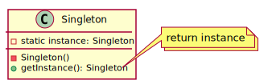
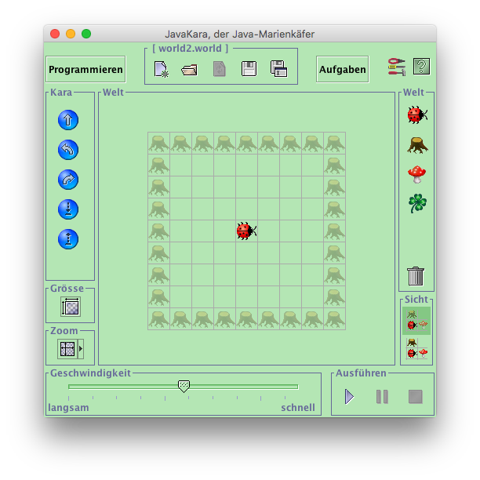
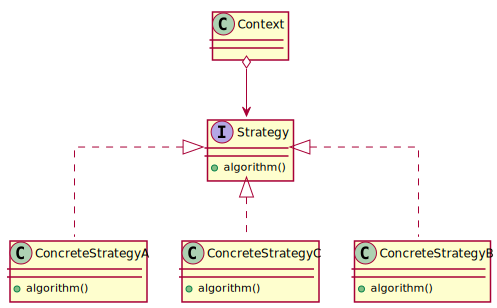
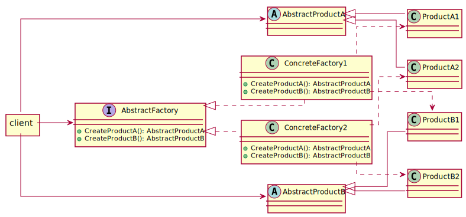
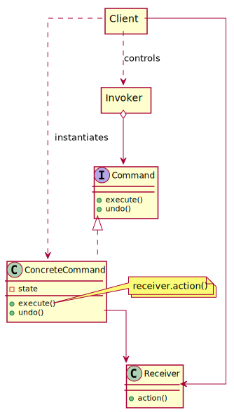

#SoftA [[../Notizen/08ln-singleton-factory-strategy-command.md]]


---

# Design Patterns, pt. 2

## Singleton, Factory

## Strategy, Command

Korbinian Riedhammer

---

# Singleton

---

# Singleton

Structure to enforce the use of a _unique_ instance.



---

# Strategy

---

# Strategy



---

# Strategy

```java
public class Kara extends JavaKaraProgram {
	public static void main(String[] args) throws Exception {
		Kara k = new Kara();
		k.run("src/main/resources/world2.world");
	}

	@Override
	public void myMainProgram() {
		kara.move();        // one step forward
		kara.turnLeft();    // you guessed it...
		kara.turnRight();   // turn right
		kara.treeFront();   // tree ahead?
		kara.putLeaf();     // take a clover leaf
		kara.removeLeaf();  // remove a clover leaf		
	}
}
```

How place leafs on every field?

---

# Strategy

Mechanism to provide different implementations to achieve the same outcome.



---

# Factory

---

# Factory

Composite pattern:

```json
{
	"key": "value",
	"nested": {
		"key": "value"
	}
}
```

```xml
<element>
	<key>value</key>
	<element>
		<key>value</key>
	</element>
</element>
```

---

# Factory

```java
interface Component {
	String toString();
}
interface Composite extends Component {
	void add(Component c);
}
interface Leaf extends Component {
}
```

```java
JsonComposite root = new JsonComposite("root");
root.add(new JsonLeaf("key", "value"));

Composite nested = new JsonComposite("nested");
nested.add(new JsonLeaf("key", "value"));
root.add(nested);

System.out.println(root);
// "root": {"key": "value", "nested": {"key": "value"}}
```

---

# Factory

Structure to enforce the use of abstract factories and products, by hiding the actual instantiation of the concrete factory and products.



---

# Command

---

# Command

.w40[

]

Mechanism to organize, execute and undo operations on certain objects.
