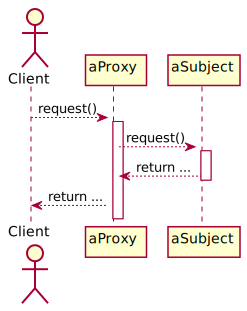

#SoftA [[../Notizen/09ln-proxy-adapter-flyweight.md]]

---

# Design Patterns, pt. 3

## Proxy, Adapter and Flyweight

Korbinian Riedhammer

---

# Proxy




---

# Proxy

## Variants

**Remote** proxy (aka. _Ambassador_): Provides local proxy to remote object (different process or physical location)

**Virtual** proxy: Creates expensive objects on demand; not to be confused with singleton (unique instance)

**Protection** Proxy: controls access to the original object, e.g. read-only access that simulates write.

---

# Proxy

## Examples

Caching for network requests.

Log output routing.

Lazy initialization of expensive objects.

Related: security facade; behaves like proxy, but hides error handling or authentication.

---

# Proxy, Decorator and Composite

## Decorator

Adds functionality without subclassing: one enclosed instance plus extra logic.

## Composite

Models a recursive structure, such as user interface widgets: arbitrary number of enclosed instances, logic typically restricted to traversing the structure or specific to leaf classe.

## Proxy

Mimics the original object (!) while adding access control or caching.

---

# Adapter

## Class Adapter

.skip[

]

---

# Adapter

## Object Adapter

.skip[

]

Best choice if implementation of Adaptee unknown.

---

# Flyweight

Example HTML to render:

```html
<ul>
	<li></li>
	<li></li>
	<li></li>
	<li></li>
</ul>
```

---

# Flyweight

A different example:

```html
<ul>
	<li></li>
	<li></li>
	<li></li>
	<li></li>
</ul>
```

---

# Flyweight


**Intrinsic state** becomes the _flyweight_.

**Extrinsic state** managed by client; extrinsic state injected.

---

# Flyweight

## Recipe

0. Do you create a lot of objects?
1. Identify what's _intrinsic_ and _extrinsic_ to your class.
2. Move intrinsic parts to _flyweight_, create factory.
3. Reduce original class to extrinsic parts

## Notes

- The term _flyweight_ is misleading: it is _light_ in a sense of _less and static parts_, but often contains the "heavy" objects.
- Often there is no `operation()`, but just a reference to a shared object.
- The flyweight if often used in combination with the composite pattern (hence `operation()`) 

---

# Flyweight

## Examples

Glyph (letter) rendering for text fields; intrinsic state: true-type fonts (often several MB), extrinsic state: position on screen, scale (size).

Browser rendering the same media multiple times; intrinsic state: actual media (image, video, audio), extrinsic state: location on screen

Android `RecyclerView`; intrinsic state: inflated layout of `RecycleView`, extrinsic state: actual contents to be displayed (often nested with further Flyweight).

Video games rendering/tiling engines; intrinsic state: actual texture or tile, extrinsic state: 3D location and orientation

---

# Summary of Design Patterns

There is a total of 23 design patterns described by Gamma _et al._

## Creational Patterns

- Factory and factory method
- Singleton

---

# Summary of Design Patterns

## Structural Patterns

- Adapter
- Composite
- Decorator
- Flyweight
- Proxy

---

# Summary of Design Patterns

## Behavioral Patterns
- Command
- Iterator
- Observer
- State
- Strategy
- Template method
