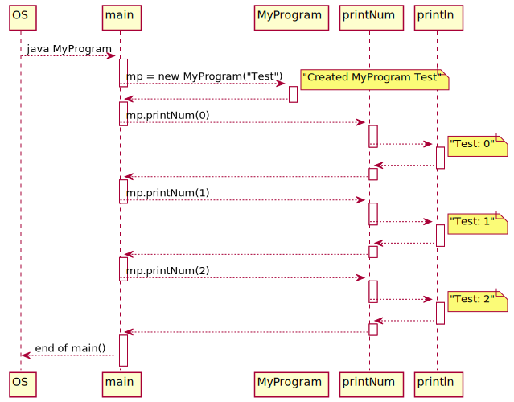
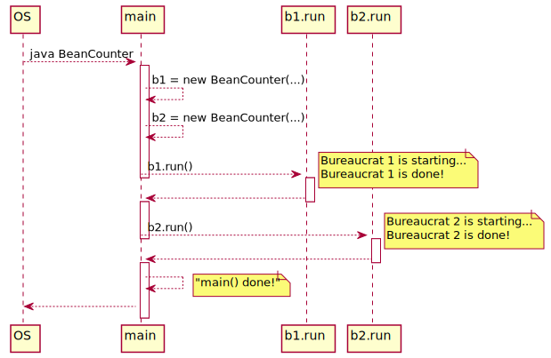
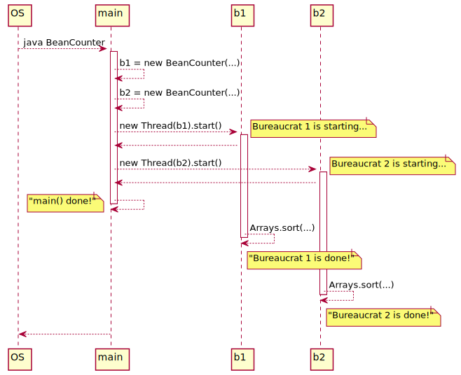
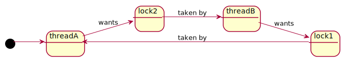
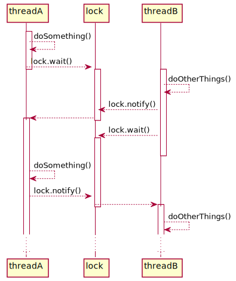
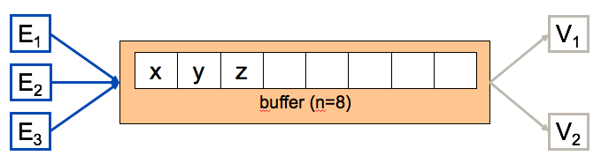
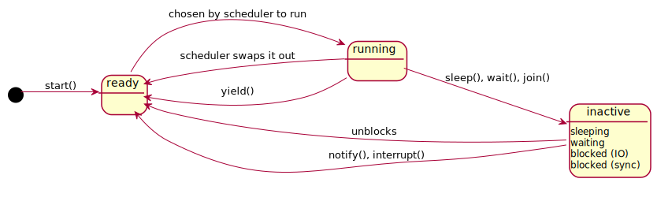

#SoftA [[../Notizen/10ln-threads.md]]

---

# Parallel Processing

## Threads

Korbinian Riedhammer

---

# Process

```java
class MyProgram {
	String name;
	MyProgram(String name) {
		this.name = name;
		System.out.println("Created MyProgram: " + name);
	}
	void printNum(int n) {
		System.out.println(name + ": " + n);
	}
	public static void main(String[] args) {
		MyProgram mp = new MyProgram("Test");
		for (int i = 0; i < 3; i++)
			mp.printNum(i);
	}
}
```

---

# Process



---

# Bean Counters

```java
class BeanCounter {
	private final String name;
	private final double[] data;
	BeanCounter(String name, int n) {
		this.name = name;
		this.data = new double [n];
	}

	public void run() {
		System.out.println(name + " is starting...");
		Arrays.sort(data);
		System.out.println(name + " is done!");
	}
}
```
```java
public static void main(String... args) {
	BeanCounter b1 = new BeanCounter("Bureaucrat 1", 10000);
	BeanCounter b2 = new BeanCounter("Bureaucrat 2", 1000);

	b1.run();
	b2.run();

	System.out.println("main() done!");
}
```

---

# Bean Counters



---

# Threaded Bean Counters

```java
class BeanCounter implements Runnable {
	// ...
}
```

```java
public static void main(String[] args) {
	BeanCounter b1 = new BeanCounter("Bureaucrat 1", 10000);
	BeanCounter b2 = new BeanCounter("Bureaucrat 2", 1000);

	new Thread(b1).start();
	new Thread(b2).start();

	System.out.println("main() done!");
}
```

---
# Threaded Bean Counters

.w80[

]

---

# Threading: Examples

Multi-threaded programming is ubiquitous in modern applications:
- browser: loading multiple resources at a time using concurrent connections
- rendering multiple animations on a page/screen
- handling user interactions such as clicks or swipes
- sorting data using divide-and-conquer
- concurrent network, database and device connections
- ability to control (pause, abort) certain long-lasting processes

---

# Shared Resources

```java
class Counter {
	private int c = 0;
	int getCount() { 
		return c; 
	}
	void increment() {
		c = c + 1;
	}
}
```
```java
public class TeamBeanCounter implements Runnable {
	Counter c;
	TeamBeanCounter(Counter c) {
		this.c = c;
	}

	@Override
	public void run() {
		for (int i = 0; i < 100000; i++) {
			c.increment();
		}
		System.out.println("Total beans: " + c.getCount());
	}
}
```

---

# Shared Resources

```java
public static void main(String[] args) {
	Counter c = new Counter();

	new Thread(new TeamBeanCounter(c)).start();
	new Thread(new TeamBeanCounter(c)).start();
	new Thread(new TeamBeanCounter(c)).start();
	new Thread(new TeamBeanCounter(c)).start();
}
```

```
Total beans: 362537
```

---

# Shared Resources: Inconsistent State!

.pure-table.pure-table-bordered.pure-table-striped[
|   | Thread 1 | Thread 2 | _result_ |
| - | -------- | -------- | -------- |
| 1 | tmp1 = c |          | tmp1 = 0 |
| 2 |          | tmp2 = c | tmp2 = 0 |
| 3 | ++tmp1   |          | tmp1 = 1 |
| 4 |          | ++tmp2   | tmp2 = 1 |
| 5 | c = tmp1 |          | c = 1    |
| 6 |          | c = tmp2 | **c = 1 !** |
]

---

# Deadlock



---

# Wait - Notify



---

# Consumer/Producer and Synchronized Buffer



---

# Thread Lifecycle


