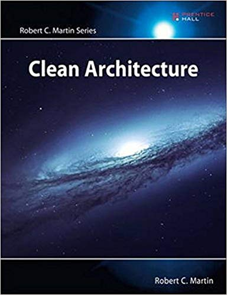
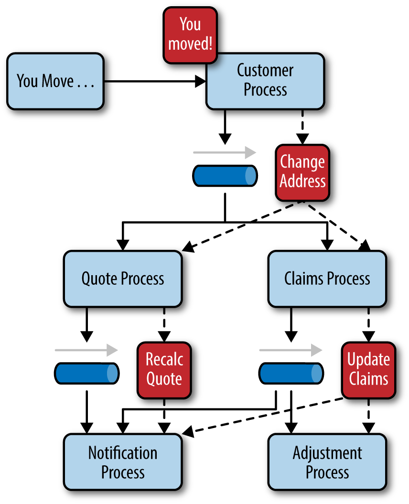
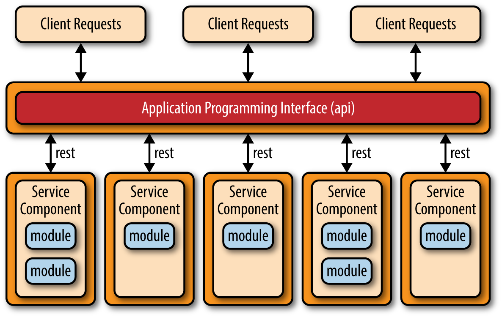

#SoftA 

---

# Patterns of Modern Software Architecture

Korbinian Riedhammer

---

# Design = Architecture

_&raquo; The goal of software architecture is to minimize the human resources required to build and maintain the required system. &laquo;_

.right[Robert C Martin (_Uncle Bob_). Clean Architecture]

???

Ein interessanter Nachmittag...

---

# Software Architecture Patterns

### Layered Architecture
### Service Oriented Architecture
### Event-driven Architecture
### Microkernel Architecture
### Microservices Architecture

.tiny[.right[_Most figures taken from Mark Richards: Software Architecture Patterns, Wiley, 2015._]]

---

# Layered Architecture

- components organized into horizontal layers
- layers represent a specific role within the application

.center[

]

---

# Layered Architecture (cont'd)

.center[

]

- separation of concern among components; clear interfaces between layers
- components within a specific layer deal only with logic that pertains to that layer
- _layers of isolation_: no skipping of closed layers

???

Example: change GUI toolkit, retain logic and persistence

---

# Layered Architecture (cont'd)

.center[

]

- exception: if a layer would mostly forward requests
- example: service layer
	- unreachable for presentation
	- bypassable for business

--- 

# Layered Architecture: Example

.center[

]

???

DAO = database access object

---

# Layered Architecture

### Discussion

- solid general purpose pattern
- easy to implement and test
- watch out for _architecture sinkhole anti-pattern:_ requests flow through multiple layers with little to no logic performed
- tends to lead to monolithic designs

---

# Service Oriented Architecture (SOA)

.center[

]

.right[Source: ibm.com]

---

# SOA: Principles

- **standardized service contract**: specified through one or more service description documents.
- **loose coupling**: services are designed as self-contained components, maintain relationships that minimize dependencies on other services
- **abstraction**: services are completely defined by service contracts and description documents; logic is hidden and encapsulated within their implementation
- **reusability**: designed as components, services can be reused more effectively, thus reducing development time
- **autonomy**: services have control over the logic they encapsulate
- **discoverability**: services are defined by description documents and listed in a service discovery
- **composability**: services are building blocks for applications

---

# SOA: Discussion

- autonomy helps for reusability, maintenance and deployment
- high (initial) investment to specify architecture
- high overhead: every service needs to do input parameter validation

---

# Event-driven Architecture

- highly decoupled, single-purpose event processing components
- asynchronous event processing
- two main topologies
	- mediator
	- broker

---

# Event-driven Architecture: Mediator

.center[

]

---

# Event-driven Architecture: Mediator Example

.center[

]

---

# Event-driven Architecture: Broker

.center[

]

---

# Event-driven Architecture: Broker Example

.center[

]

---

# Event-driven Architecture

### Discussion

- excellent scalability and unit-testing
- asynchronicity brings complexity, eg.
	- remote process availability
	- lack of responsiveness
	- broker reconnection logic in the event of a broker or mediator failure
- lack of atomic transactions for business processes
- requires discipline regarding event format (eg. JSON)
- end-to-end testing hard

---

# Event-driven Architecture

### Toolkits

- Apacha Kafka: <https:/kafka.apache.org/>
- Otto: application-based event bus <https:/square.github.io/otto/>
- Reactive Programming: <https:/github.com/ReactiveX/RxJava>

---

# Microkernel Architecture

### Or: Plugin Architecture

.center[

]

---

# Microkernel Architecture

- make your product flexible in terms of features and extensibility
- core has minimum functionality, foremost plugin handling (registry)
- keep communication/dependency among plugins to minimum
- plugin-core-connection
	- OSGi (open service gateway initiative)
	- messaging
	- web services 
	- direct point-to-point binding (i.e., object instantiation)
- example: photoshop :-)

---

# Microservices Architecture

An alternative to monolithic applications.

- central concept: separately deployed units
	- easier deployment through an effective and streamlined delivery pipeline
	- increased scalability
	- high degree of application and component decoupling
- service components that act in bounded context
- the hard part: getting the granularity right

See <https:/www.bmc.com/blogs/microservices-vs-soa-whats-difference/> for a good differentiation to service oriented architecture (SOA).

---

# Microservices Architecture (cont'd)

### Variant: API REST-based

.center[

]

---

# Microservices Architecture (cont'd)

### Variant: Application REST-based

.center[

]

- similar to API REST-based, but requests from browser or fat-client

---

# Microservices Architecture (cont'd)

### Variant: Centralized Messaging System

.center[

]

- typical for larger-scale application
- allows for advanced queuing mechanisms, asynchronous messaging, monitoring, error handling, and better overall load balancing and scalability

---

# Microservices Architecture

### Discussion

- vital to get the granularity right
	- too fine: scaling or communication hell
	- too coarse: no benefit
- inter-service communication should use database instead of tight coupling
- excellent testing capabilities
- excellent deployment: "hot-swap" instances until no old instance left
- ideal for containerization → simple orchestration!

---

# Microservices vs. SOA

- SOA requires all participants to know the common communication mechanism
- In SOA, services (typically) share data storage; microservices maintain their own
- SOA may entail microservices

